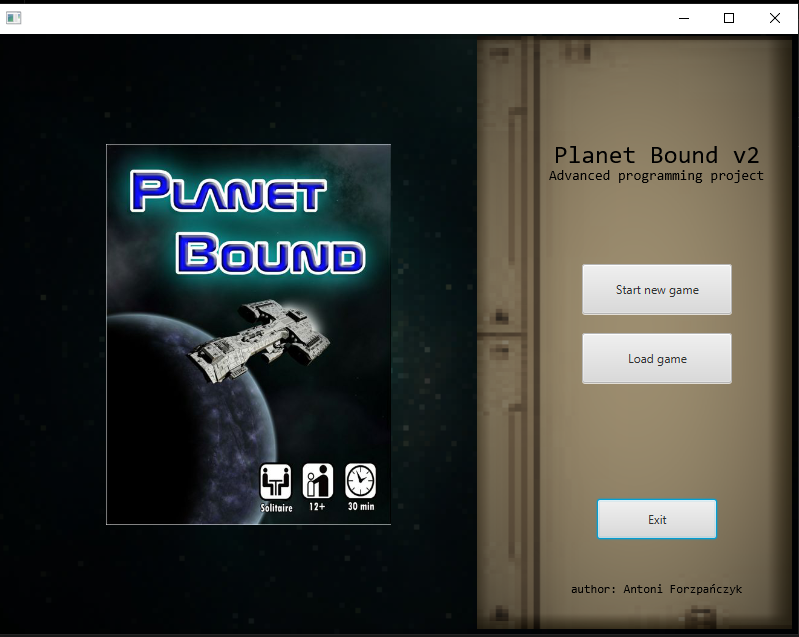
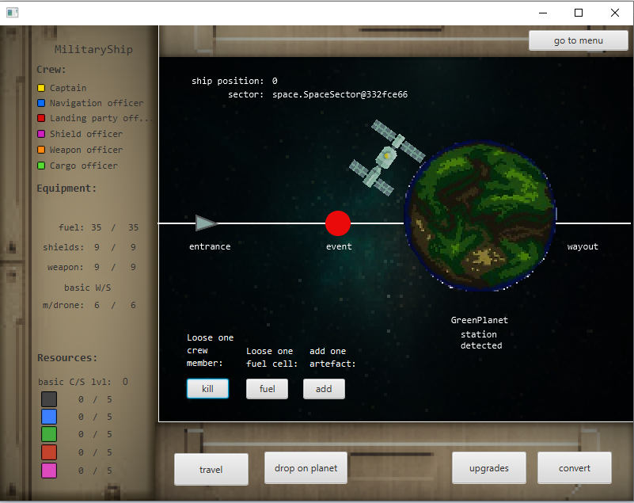

# Planet Bound board game adaptation

Project realized on ISEC - Instituto Superior de Engenharia de Coimbra as a paticipant of Advanced Programming subject in practical section. Application is a representation of the board game called "Planet bound". Whole project was realized using Java 11 language with the utilization of JavaFx 14 as graphical library. 

To see full description of the original game click: [https://boardgamegeek.com/boardgame/298332/planet-bound](https://boardgamegeek.com/boardgame/298332/planet-bound)

In the project there were used several programming patterns:
* View-Model pattern (to seperate Logic and GUI)
* Object pattern with own property immplementation
* State-machine pattern to represent states of the board game and provide consistency of the whole gameplay

Project has also implemented Logger and Serialization.

author: Antoni Forzpańczyk

Menu view:

  

Game view:

  

